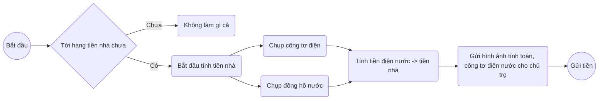
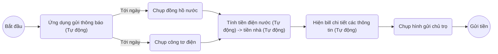
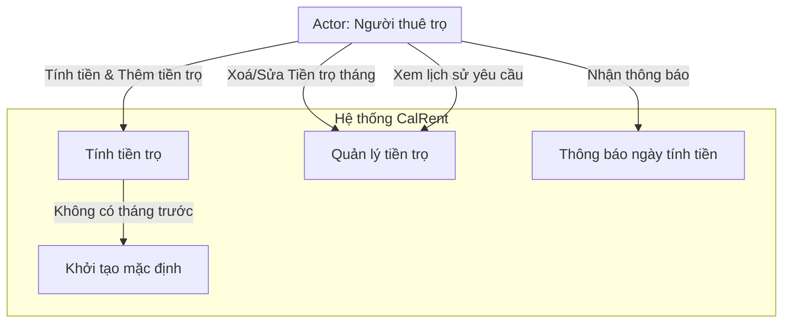
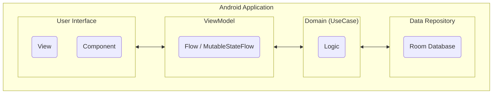
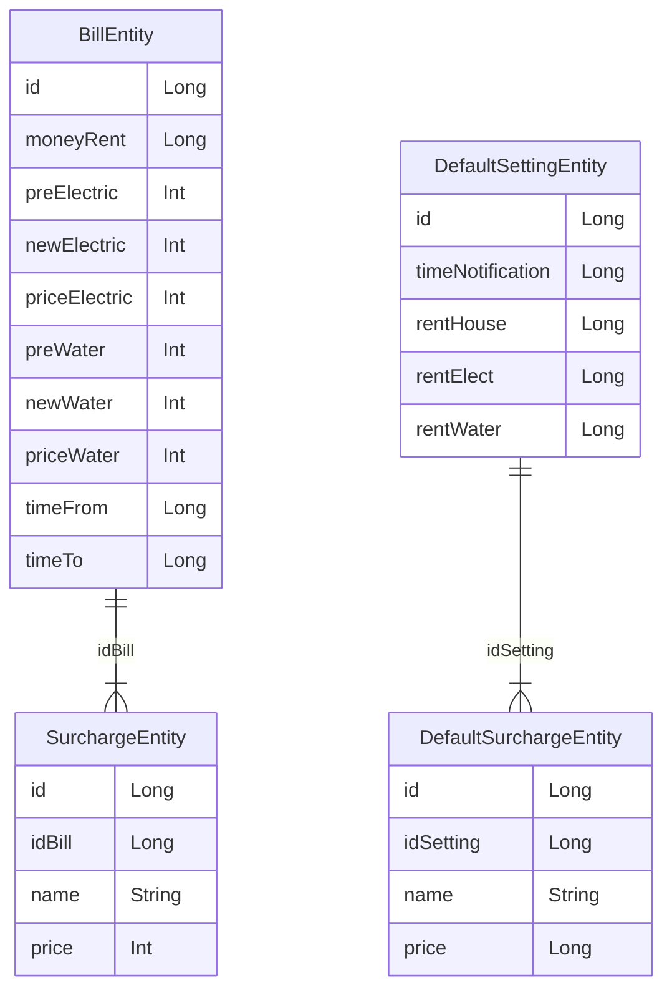
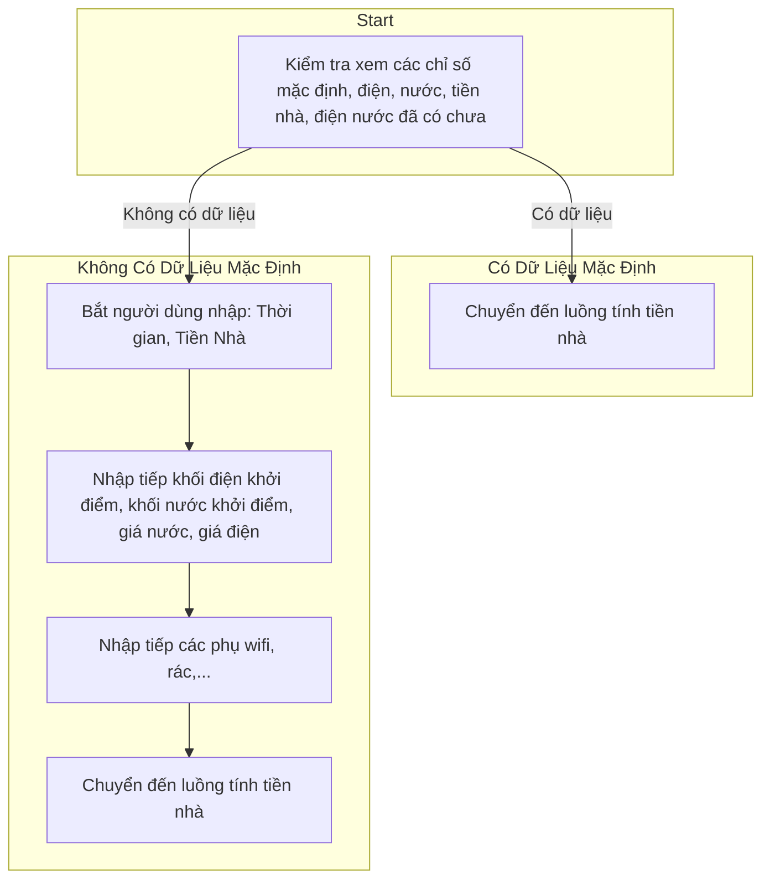
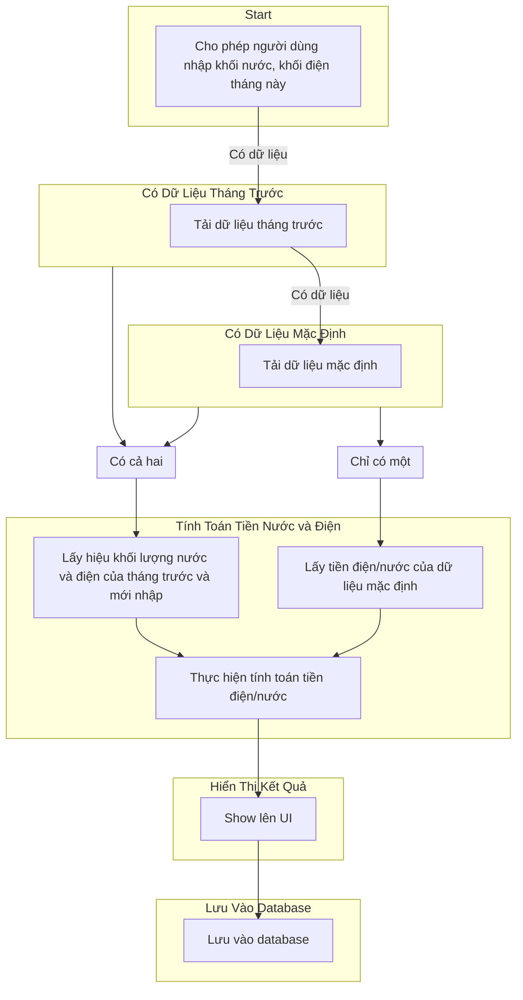

Welcome to the CalRent wiki!

# Software Modeling

## Modeling business processes

- Tính tiền nhà thủ công.

- Tính tiền nhà dùng app.

## User Requests

Ứng dụng calRent giải quyết sự phiền phức trong việc tính toán và gửi tiền trọ hàng tháng. Người dùng có thể tạo yêu cầu mới, nhập thông số đo điện nước, và nhận thông báo về hạn đóng tiền. Lịch sử yêu cầu được lưu trữ, và thông tin về người thuê trọ và chủ trọ được quản lý. Báo cáo thống kê và hỗ trợ khách hàng cũng là những tính năng quan trọng của ứng dụng.

## Modeling User Requirements

### Use case diagram

#### List of use case

| ID       | Tên                      | Mô tả ngắn                                                                                                                                                                                                                                  |
|----------|--------------------------|---------------------------------------------------------------------------------------------------------------------------------------------------------------------------------------------------------------------------------------------|
| UC - 001 | Tính tiền trọ            | Use case này cho phép người thuê trọ tính tiền trọ cho một tháng cụ thể. Người dùng có thể nhập các thông số như khối nước, khối điện và các phụ thu (ví dụ: wifi, rác), sau đó ứng dụng sẽ tính toán số tiền cần đóng và hiển thị kết quả. |
| UC - 002 | Quản lý tiền trọ         | Use case này cho phép người dùng quản lý thông tin về tiền trọ, bao gồm lịch sử các yêu cầu tính tiền trọ và các thông tin cá nhân như tên, địa chỉ. Người dùng có thể xem lịch sử, chỉnh sửa thông tin và thêm mới thông tin cần thiết.    |
| UC - 003 | Thông báo ngày tính tiền | Use case này tự động thông báo đến người thuê trọ về ngày đến hạn đóng tiền. Ứng dụng sẽ gửi thông báo nhắc nhở để người thuê trọ không quên việc thanh toán tiền trọ vào ngày hợp lệ.                                                      |
| UC - 004 | Khởi tạo mặc định        | Use case này sử dụng để lấy thông tin mặc định về phòng trọ, bao gồm tiền thuê, tiền nước, khối điện ban đầu, khối nước ban đầu, và các phí phụ thu sau đó lưu chúng vào cơ sở dữ liệu.                                                     |

#### Use case specification

1. Tính tiền trọ

| ID                       | UC - 001                                                                                                                                                                                                                                                                                                                                                                                                                                                                                                                                                        |
|--------------------------|-----------------------------------------------------------------------------------------------------------------------------------------------------------------------------------------------------------------------------------------------------------------------------------------------------------------------------------------------------------------------------------------------------------------------------------------------------------------------------------------------------------------------------------------------------------------|
| **Tên**                  | Tính tiền trọ                                                                                                                                                                                                                                                                                                                                                                                                                                                                                                                                                   |
| **Mô tả ngắn**           | Use case này cho phép người thuê trọ tính tiền trọ cho một tháng cụ thể. Người dùng có thể nhập các thông số như khối nước, khối điện và các phụ thu (ví dụ: wifi, rác), sau đó ứng dụng sẽ tính toán số tiền cần đóng và hiển thị kết quả.                                                                                                                                                                                                                                                                                                                     |
| **Người dùng**           | Người thuê trọ                                                                                                                                                                                                                                                                                                                                                                                                                                                                                                                                                  |
| **Luồng cơ bản**         | 1. Người thuê trọ khởi động ứng dụng.  2. Người thuê trọ chọn use case "Tính tiền trọ".  3. Hệ thống yêu cầu người thuê trọ nhập các thông số: khối nước, khối điện và các phụ thu (nếu có).  4. Người thuê trọ nhập thông số và xác nhận.  5. Hệ thống tính toán số tiền cần đóng dựa trên thông số nhập vào và thông tin về giá điện/nước (của tháng trước hoặc nhập mặc định từ đầu).  6. Hệ thống hiển thị kết quả tính toán trên giao diện người dùng. 7. Người thuê trọ có thể lưu kết quả hoặc thực hiện lại tính toán nếu cần. |
| **Luồng thay thế**       | *Bước 3:* Nếu người thuê trọ không nhập đủ thông số, hệ thống hiển thị thông báo lỗi và yêu cầu nhập lại thông số.   *Bước 4:* Nếu người thuê trọ không xác nhận thông số, quy trình kết thúc.   *Bước 6:* Nếu có lỗi trong quá trình tính toán, hệ thống hiển thị thông báo lỗi và yêu cầu người thuê trọ kiểm tra lại thông số nhập và thực hiện lại tính toán.                                                                                                                                                                                       |
| **Yêu cầu đặc biệt**     |                                                                                                                                                                                                                                                                                                                                                                                                                                                                                                                                                                 |
| **Điều kiện tiên quyết** | Hệ thống phải có chỉ số tháng trước hoặc chỉ số mặc định                                                                                                                                                                                                                                                                                                                                                                                                                                                                                                        |
| **Hậu điều kiện**        | Kết quả tính toán được hiển thị trên giao diện người dùng và có thể được lưu vào cơ sở dữ liệu nếu người thuê trọ muốn.                                                                                                                                                                                                                                                                                                                                                                                                                                         |
| **Điểm mở rộng**         |                                                                                                                                                                                                                                                                                                                                                                                                                                                                                                                                                                 |

2. Quản lý tiền trọ

| ID                       | UC - 002                                                                                                                                                                                                                                                                                                                                                                                                                                        |
|--------------------------|-------------------------------------------------------------------------------------------------------------------------------------------------------------------------------------------------------------------------------------------------------------------------------------------------------------------------------------------------------------------------------------------------------------------------------------------------|
| **Tên**                  | Quản lý tiền trọ                                                                                                                                                                                                                                                                                                                                                                                                                                |
| **Mô tả ngắn**           | Use case này cho phép người dùng quản lý thông tin về tiền trọ, bao gồm lịch sử các yêu cầu tính tiền trọ và các thông tin cá nhân như tên, địa chỉ. Người dùng có thể xem lịch sử, chỉnh sửa thông tin và thêm mới thông tin cần thiết.                                                                                                                                                                                                        |
| **Người dùng**           | Người thuê trọ                                                                                                                                                                                                                                                                                                                                                                                                                                  |
| **Luồng cơ bản**         | 1. Người thuê trọ khởi động ứng dụng. 2. Người thuê trọ chọn use case "Quản lý tiền trọ". 3. Hệ thống hiển thị thông tin phòng trọ, bao gồm tên, địa chỉ, giá nước điện, các phụ phí khác. 4. Người thuê trọ có thể xem lịch sử các yêu cầu tính tiền trọ trước đó.  5. Người thuê trọ có thể chỉnh sửa thông tin phòng trọ nếu cần. 6. Người thuê trọ có thể thêm mới thông tin cần thiết (ví dụ: thông tin liên hệ). |
| **Luồng thay thế**       | *Bước 5:* Nếu người thuê trọ không muốn chỉnh sửa thông tin phòng trọ, quy trình kết thúc.   *Bước 6:* Nếu người thuê trọ không thêm mới thông tin, quy trình kết thúc.                                                                                                                                                                                                                                                                     |
| **Yêu cầu đặc biệt**     |                                                                                                                                                                                                                                                                                                                                                                                                                                                 |
| **Điều kiện tiên quyết** |                                                                                                                                                                                                                                                                                                                                                                                                                                                 |
| **Hậu điều kiện**        | Thông tin phòng trọ và lịch sử các yêu cầu tính tiền trọ có thể được cập nhật và lưu vào cơ sở dữ liệu.                                                                                                                                                                                                                                                                                                                                         |
| **Điểm mở rộng**         |                                                                                                                                                                                                                                                                                                                                                                                                                                                 |

3. Thông báo ngày tính tiền

| ID                       | UC - 003                                                                                                                                                                                                                                                                                                       |
|--------------------------|----------------------------------------------------------------------------------------------------------------------------------------------------------------------------------------------------------------------------------------------------------------------------------------------------------------|
| **Tên**                  | Thông báo ngày tính tiền                                                                                                                                                                                                                                                                                       |
| **Mô tả ngắn**           | Use case này tự động thông báo đến người thuê trọ về ngày đến hạn đóng tiền. Ứng dụng sẽ gửi thông báo nhắc nhở để người thuê trọ không quên việc tính tiền trọ vào ngày hợp lệ.                                                                                                                               |
| **Người dùng**           | Người thuê trọ                                                                                                                                                                                                                                                                                                 |
| **Luồng cơ bản**         | 1. Hệ thống tự động xác định ngày đến hạn đóng tiền dựa trên thông tin trong cơ sở dữ liệu.  2. Hệ thống tự động gửi thông báo nhắc nhở đến người thuê trọ trước ngày đến hạn đóng tiền (ví dụ: 3 ngày trước).   3. Người thuê trọ nhận thông báo và có thể đứa đến chức năng tính tiền trọ nếu cân. |
| **Luồng thay thế**       | *Bước 3:* Nếu người thuê trọ không xem thông tin chi tiết về việc tính tiền trọ, quy trình kết thúc.                                                                                                                                                                                                           |
| **Điều kiện tiên quyết** | Hệ thống đã lưu thông tin về ngày đến hạn đóng tiền trong cơ sở dữ liệu.                                                                                                                                                                                                                                       |
| **Hậu điều kiện**        | Thông báo nhắc nhở đã được gửi thành công đến người thuê trọ và có thể xem trên ứng dụng nếu cần.                                                                                                                                                                                                              |
| **Điểm mở rộng**         | Có thể thêm tính năng cho phép người thuê trọ thực hiện thanh toán tiền trọ trực tiếp từ ứng dụng.                                                                                                                                                                                                             |

4. Khởi tạo mặc định

| ID                       | UC - 004                                                                                                                                                                                                                                                  |
|--------------------------|-----------------------------------------------------------------------------------------------------------------------------------------------------------------------------------------------------------------------------------------------------------|
| **Tên**                  | Khởi tạo mặc định                                                                                                                                                                                                                                         |
| **Mô tả ngắn**           | Use case này dùng để thu thập thông tin mặc định về phòng trọ, bao gồm tiền thuê, tiền nước, khối điện ban đầu, khối nước ban đầu, và các phí phụ thu, sau đó lưu chúng vào cơ sở dữ liệu.                                                                |
| **Người dùng**           | Người thuê trọ                                                                                                                                                                                                                                            |
| **Luồng cơ bản**         | 1. Người thuê trọ khởi động ứng dụng.   2. Người thuê trọ chọn use case "Khởi tạo mặc định".   3. Hệ thống thu thập thông tin mặc định về phòng trọ.   4. Hệ thống lưu thông tin thu thập vào cơ sở dữ liệu.   5. Quá trình kết thúc. |                                                                                                                                                                                      |
| **Luồng thay thế**       | Bước 4: Nếu hệ thống không thể lưu thông tin vào cơ sở dữ liệu, quy trình kết thúc và thông báo lỗi cho người dùng.                                                                                                                                       |                                                                                                                                                                           |
| **Điều kiện tiên quyết** | Database chưa có thông tin mặc định của phòng                                                                                                                                                                                                             |
| **Hậu điều kiện**        | Thông tin mặc định đã được lưu vào cơ sở dữ liệu và có thể sử dụng cho việc tính toán tiền trọ và quản lý phòng trọ.                                                                                                                                      |
| **Điểm mở rộng**         | Có thể bổ sung tính năng cho phép người thuê trọ cập nhật hoặc chỉnh sửa thông tin mặc định trong tương lai.                                                                                                                                              | 

### User Story Map

| Tính tiền điện nước            | Quản lý tiền trọ                      | Thông báo ngày tính tiền     | Khởi tạo mặc định           |
|--------------------------------|---------------------------------------|------------------------------|-----------------------------|
| Ghi nhận tiêu thụ điện nước    | Xem Lịch sử thanh toán tiền trọ       | Thông báo đến hạn thanh toán | Ghi nhận thông tin thủ công |
| Lưu kết quả tính toán          | Xóa lịch sử thanh toán đã chọn        | Tắt/Bật thông báo            |                             |
| Nhập điện nước qua hình ảnh    | Chỉnh sửa thông tin tiền trọ đã chọn  |                              |                             |
| Nhập điện nước từ hình hóa đơn | Chỉnh sửa thông tin mặc định tiền trọ |                              |                             |

### User Story Description For MVP

| Tiêu đề: Lưu kết quả tính toán   |
|----------------------------------|
| User story:                      |
| System provide:                  |

| Tiêu đề: Ghi nhận điện nước tiêu thụ thủ công                                                                                                                                                                                                                                                                           |
|---------------------------------------------------------------------------------------------------------------------------------------------------------------------------------------------------------------------------------------------------------------------------------------------------------------------------------------|
| User story: Người dùng muốn có khả năng ghi nhận tiêu thụ điện nước hàng tháng bằng cách nhập thủ công các chỉ số đo điện và nước vào ứng dụng di động của họ.                                                                                                                                                                        |
| System provide: Hệ thống cung cấp giao diện cho phép người dùng nhập các chỉ số đo điện và nước một cách dễ dàng. Sau khi người dùng nhập các thông số này, hệ thống sẽ tính toán tự động số tiền phải đóng dựa trên giá tiền đã được định sẵn. Kết quả tính toán sẽ được hiển thị trên giao diện để người dùng xem trước và xác nhận. |

| Tiêu đề: Lưu kết quả tính toán                                                                                                                                                                                                                                                                               |
|--------------------------------------------------------------------------------------------------------------------------------------------------------------------------------------------------------------------------------------------------------------------------------------------------------------|
| User story: Người dùng muốn có khả năng lưu trữ kết quả tính toán tiền trọ sau khi đã nhập thông số đo điện và nước vào ứng dụng di động.                                                                                                                                                                    |
| System provide: Hệ thống cung cấp tính năng lưu trữ kết quả tính toán, bao gồm thông tin về số tiền cần đóng, tháng tính tiền, và các thông số đo điện và nước tương ứng. Kết quả tính toán sẽ được lưu trữ trong cơ sở dữ liệu của ứng dụng để người dùng có thể xem lại và theo dõi lịch sử tính tiền trọ. |

| Tiêu đề: Nhập điện nước qua hình ảnh                                                                                                                                                                                                                                                                                                                                                                                            |
|---------------------------------------------------------------------------------------------------------------------------------------------------------------------------------------------------------------------------------------------------------------------------------------------------------------------------------------------------------------------------------------------------------------------------------|
| User story: Người dùng muốn có khả năng nhập thông số đo điện và nước thông qua hình ảnh để tiết kiệm thời gian và công sức.                                                                                                                                                                                                                                                                                                    |
| System provide: Hệ thống cung cấp tính năng cho phép người dùng chụp hình ảnh hoặc tải lên hình ảnh của đồng hồ điện và nước. Hệ thống sẽ tự động phân tích hình ảnh để trích xuất thông tin về các con số đo điện và nước. Sau đó, thông tin này sẽ được nhập tự động vào ứng dụng để tiến hành tính toán tiền trọ. Điều này giúp người dùng dễ dàng và nhanh chóng cập nhật thông tin mà không cần phải nhập tay từng con số. |

| Tiêu đề: Nhập điện nước từ hình hóa đơn                                                                                                                                                                                                                                                                                                                                                                             |
|---------------------------------------------------------------------------------------------------------------------------------------------------------------------------------------------------------------------------------------------------------------------------------------------------------------------------------------------------------------------------------------------------------------------|
| User story: Người dùng muốn có khả năng nhập thông số đo điện và nước từ hình ảnh của hóa đơn tiền điện và nước mà họ đã nhận được từ công ty cung cấp dịch vụ.                                                                                                                                                                                                                                                     |
| System provide: Hệ thống cung cấp tính năng cho phép người dùng tải lên hình ảnh của hóa đơn tiền điện và nước. Hệ thống sẽ tự động phân tích hình ảnh để trích xuất thông tin về các con số đo điện và nước từ hóa đơn. Sau đó, thông tin này sẽ được nhập tự động vào ứng dụng để tiến hành tính toán tiền trọ. Điều này giúp người dùng dễ dàng và nhanh chóng cập nhật thông tin từ hóa đơn mà họ đã nhận được. |

### User

### Architectural Models

### Data Modeling

### Sequence Diagram

### Innit Flow

### Calculator New Rent Month

