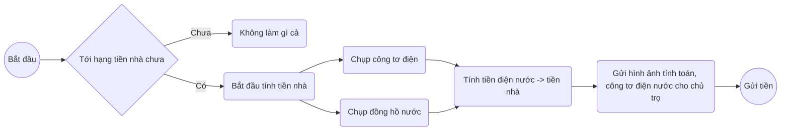
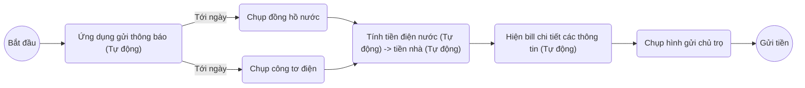
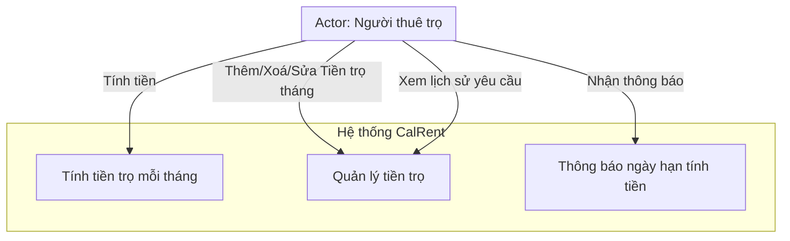
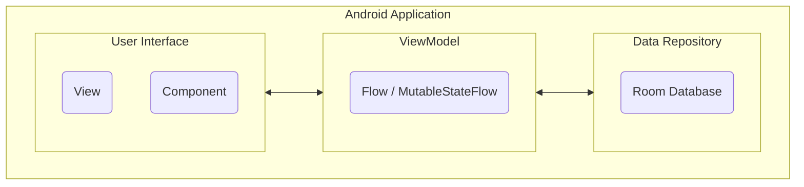
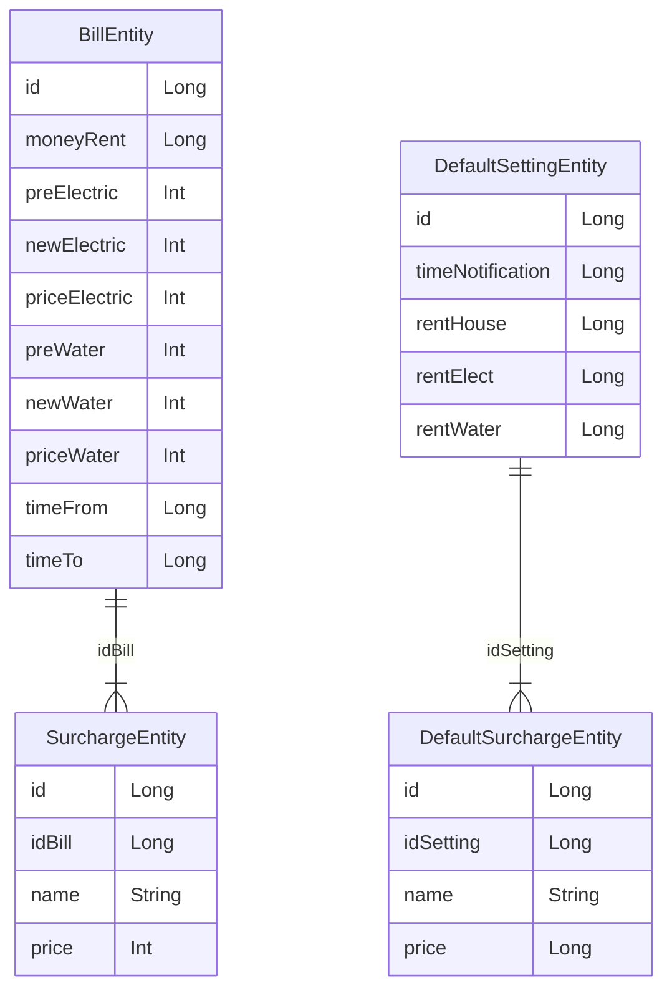
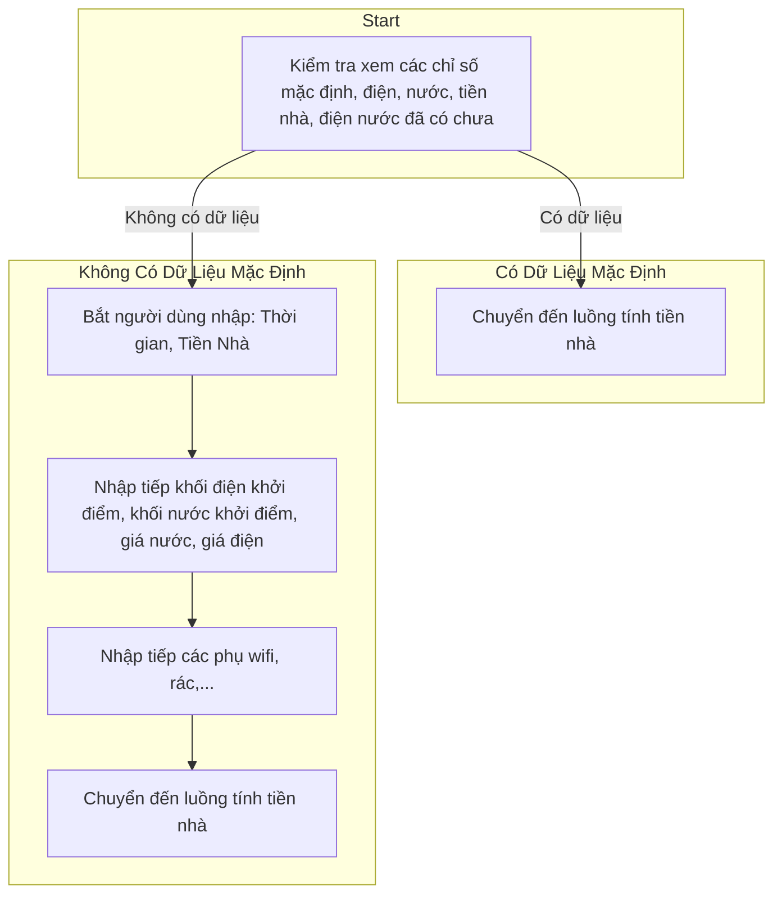
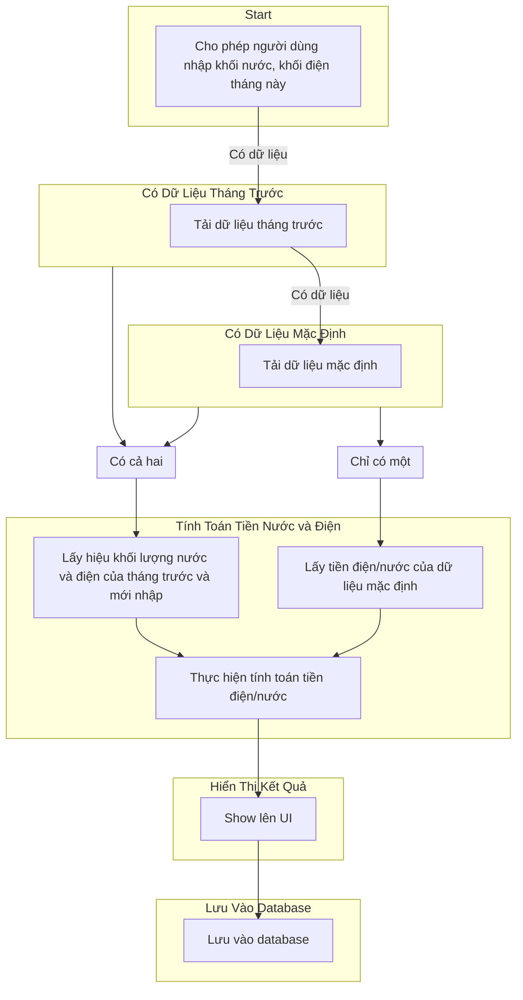

Welcome to the CalRent wiki!

# Software Modeling

## Modeling business processes

- Tính tiền nhà thủ công.

- Tính tiền nhà dùng app.

## User Requests

Ứng dụng calRent giải quyết sự phiền phức trong việc tính toán và gửi tiền trọ hàng tháng. Người dùng có thể tạo yêu cầu mới, nhập thông số đo điện nước, và nhận thông báo về hạn đóng tiền. Lịch sử yêu cầu được lưu trữ, và thông tin về người thuê trọ và chủ trọ được quản lý. Báo cáo thống kê và hỗ trợ khách hàng cũng là những tính năng quan trọng của ứng dụng.
## Modeling User Requirements

### Use case diagram

### Architectural Models

### Data Modeling

### Sequence Diagram

### Innit Flow

### Calculator New Rent Month

